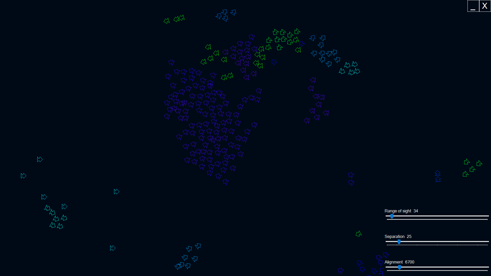

# Boids

A basic flock behaviour simulation, primarily based on the pseudocode by Conrad Parker, available here:
http://www.vergenet.net/~conrad/boids/pseudocode.html

## Build

<a href="https://github.com/kellybs1/Boids/blob/master/Build/kellybs1Boids2.exe?raw=true">/Build/kellybs1Boids2.exe</a>

Note: You may need to unblock the unsigned executable: Right click the exe -> Properties, and in the bottom section click the Unblock checkbox and then click OK.

## Source

<a href="https://github.com/kellybs1/Boids/tree/master/kellybs1Boids2">/kellybs1Boids2</a>

## Algorithm description:
The individual Boid calculates its velocity based on three basic factors:
1) Cohesion - The Boid steers towards the average position of all neighbouring Boids.
2) Alignment - The Boid steers to maintain the average velocity of neighbouring Boids.
3) Separation - The Boid steers away from neighbouring Boids if it is too close.

Different weightings are applied to the three values to modify the behaviour of the flock.
    
Each cycle of the program, each Boids updates which Boids are its neighbours, then goes through the process of updating its velocity based on the three basic factors.

## Screenshot

## Notes

Click/right-click/press ESC to toggle on-screen controls.
Application opens in full-screen on primary monitor.

